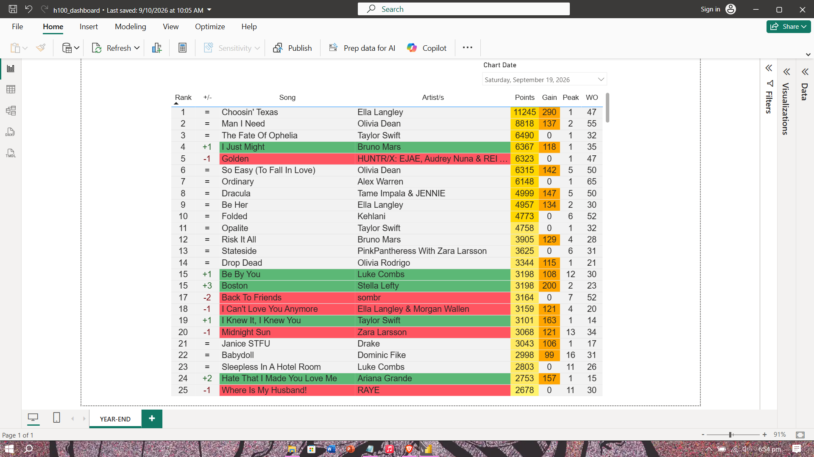
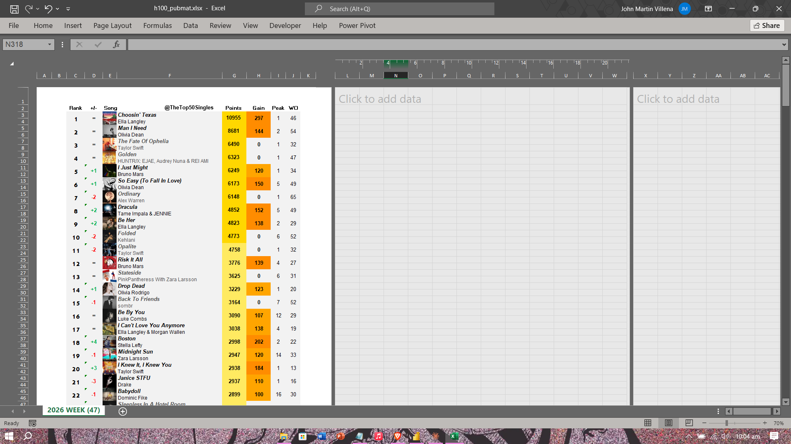
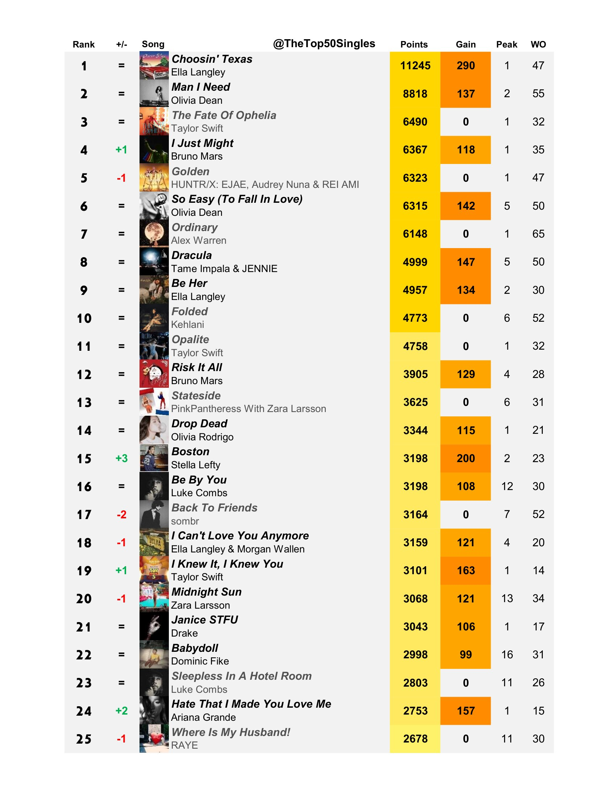

# Billboard Hot 100 Chart Tracker

A self-built data pipeline that tracks Billboard Hot 100 chart performance week over week, calculates custom yearly rankings, and produces a publication-ready weekly chart for social media. Maintained continuously since **December 2024**.

---

## Project Evolution

This project has gone through two distinct phases, kept side by side in this repo to show how it evolved:

- **v1 — Manual Excel + Power BI** (`v1-excel-powerbi/`): The original system. Chart data was tracked entirely by hand in Excel, cross-referenced into a publication file via XLOOKUP, and visualized in a Power BI dashboard driven by a manually-typed week number.
- **v2 — Python-Automated Pipeline** (`v2-python-automated/`): A rebuilt version that automates the weekly chart-data pull with a Python script, restructures the data into a long-format model (one row per song per week), and rebuilds the Power BI dashboard on a proper relational model with dynamic date-based filtering instead of a manually-typed week number.

The rebuild wasn't just automation for its own sake — it fixed several real problems the original system had:

| Problem in v1 | Fix in v2 |
|---|---|
| Songs that didn't chart a given week vanished from Power BI visuals entirely | Added a dedicated `Songs` dimension table, so every song stays visible with `0` values instead of disappearing |
| Week number was typed in by hand each week | Replaced with a real date slicer, driven by an actual `Calendar` table |
| Two-hour manual weekly data entry for chart stats | `fetch_billboard.py` pulls rank, peak position, weeks on chart, and last-week position automatically in under five minutes |
| A new Excel tab had to be duplicated every year to reset year-end tracking | Year-end ranges are now defined in a single small lookup table (`Year-End Periods`) — a new year is one new row, not a duplicated workbook |
| Two songs sharing a title (e.g. two different artists' versions of the same Christmas song) could collide in lookups | Every lookup now matches on song **and** artist together, not title alone |

---

## From Raw Data to Published Output

### Power BI Dashboard

### Weekly Chart — Excel Publication Format

### Published Output — Twitter/X

---

## Overview

What started as a personal effort to follow weekly Billboard chart movement in more depth than the official charts show has grown into a structured, multi-layer data system:

1. **`h100_raw.csv`** — the automated data layer. A Python script (`fetch_billboard.py`) pulls each week's official chart stats (rank, peak position, weeks on chart, last-week position) directly from Billboard. Points — a custom metric not published by Billboard, sourced from public prediction data and corrected against the official chart — are entered manually into the same file.
2. **`h100_wide.xlsx`** — the reporting layer. Reshapes the long-format raw data back into a wide, week-by-week view for visual growth-tracking and to feed the publication file.
3. **`h100_pubmat.xlsx`** — the publication layer. Pulls ranked data from the wide-format file via XLOOKUP and formats it into a clean, ranked weekly chart used for publishing online.
4. **`h100_dashboard.pbix`** — the visualization layer. A Power BI dashboard built on a proper relational model (fact table, Songs dimension, Calendar dimension, Year-End Periods table), visualizing chart trends and rankings with dynamic date-based slicing.

As of **Week 46**, the system is tracking **750+ songs** and **40,000+ individual weekly data points**.

---

## How It Works

**Data collection (weekly):**
`fetch_billboard.py` pulls the week's official chart stats automatically. Points are still entered manually, since Billboard doesn't publish its underlying scoring formula — this is sourced from public predictions and adjusted against the official placement once it's confirmed.

**Ranking model:**
A set of DAX measures (in v2) and Excel formulas (in v1) calculate each song's:
- `Points` — cumulative total for the current year-end range
- `Rank` — current standing based on total points
- `Peak` — highest position reached, as of the selected week
- `Weeks On` — number of weeks charting, as of the selected week
- `Gain` — points earned in the selected week specifically
- `+/-` — rank movement compared to the previous charted week

**Publication layer:**
`h100_pubmat.xlsx` mirrors the ranked output from the wide-format file using XLOOKUP, then formats it into a clean weekly leaderboard — rank, movement, points, gain, peak, and weeks on chart — ready to publish.

**Visualization layer:**
The Power BI dashboard connects to the raw long-format data through a relational model: a `Songs` dimension table (so every song stays visible even in weeks it didn't chart), a `Calendar` table (driving the date slicer), and a `Year-End Periods` table (so each year-end range is defined once, not duplicated).

---

## Files in This Repository

### `v1-excel-powerbi/`
| File | Description |
|------|-------------|
| `HOT 100 BREAKDOWN.xlsx` | Original raw weekly tracking data |
| `BREAKDOWN.xlsx` | Stacked long-format data feed for the original Power BI dashboard |
| `HOT 100 PUBMAT.xlsx` | Original publication output file, linked via XLOOKUP |
| `HOT 100 PROJECT.pbix` | Original Power BI dashboard |

### `v2-python-automated/`
| File | Description |
|------|-------------|
| `fetch_billboard.py` | Python script that pulls weekly chart stats automatically |
| `run_billboard.bat` | One-click launcher for the script |
| `h100_raw.csv` | Long-format source data — chart stats (automated) + points (manual) |
| `h100_wide.xlsx` | Reshaped wide-format reporting layer |
| `h100_pubmat.xlsx` | Formatted publication output, linked via XLOOKUP |
| `h100_dashboard.pbix` | Rebuilt Power BI dashboard — open with Power BI Desktop (free) |
| `h100_dashboard_screenshot.png` | Sample screenshot — Power BI visualization layer |
| `h100_pubmat_table.png` | Sample screenshot — Excel publication output |
| `h100_pubmat_final.png` | Sample — final graphic published to social media |

---

## Example — Week 46, 2026 (current top 5)

| Rank | +/- | Song | Artist | Points | Gain | Peak | WO |
|------|-----|------|--------|--------|------|------|----|
| 1 | = | Choosin' Texas | Ella Langley | 10,658 | +294 | 1 | 45 |
| 2 | = | Man I Need | Olivia Dean | 8,537 | +146 | 2 | 53 |
| 3 | = | The Fate Of Ophelia | Taylor Swift | 6,487 | +0 | 1 | 32 |
| 4 | = | Golden | HUNTR/X: EJAE, Audrey Nuna & REI AMI | 6,417 | +0 | 1 | 47 |
| 5 | = | Ordinary | Alex Warren | 6,146 | +0 | 1 | 65 |

*(Update this table each week with the current top 5.)*

---

## Output & Publication

Weekly chart results are published consistently to:
- 📺 [YouTube — Top50Singles](https://www.youtube.com/@TheTop50Singles) — 35K+ subscribers, 150K+ average monthly views
- 🐦 [Twitter/X — @TheTop50Singles](https://x.com/TheTop50Singles)

---

## A Note on the Data

This dataset has grown organically since the project began in December 2024. Earlier weeks have minor structural differences — for example, some early sheets are missing the `Weeks On` column, and the column layout shifted slightly a few times as the tracking system matured. Rather than retroactively cleaning this history, it has been left intact as it reflects how the system actually evolved over a year and a half of continuous, hands-on maintenance.

The v1 files represent the system as it operated through most of that history. The v2 files represent the current, actively maintained version going forward.

---

## Tools Used

- **Python** — automated weekly chart-data collection (`billboard.py` package, with a planned migration to manual `requests` + `BeautifulSoup` scraping)
- **Microsoft Excel** — data tracking, ranking formulas, XLOOKUP-based cross-file reporting
- **Microsoft Power BI** — Power Query data modeling, DAX measures, dashboard visualization of chart trends and song trajectories
- **CapCut** — used for related video content published alongside the chart data

---

## About

Built and maintained by **John Martin S. Villena**, BS Information Technology graduate (Business Analytics) from Bulacan State University.

🔗 [LinkedIn](https://www.linkedin.com/in/jhnmrtnvlln/)
📺 [YouTube](https://www.youtube.com/@TheTop50Singles)
🐦 [Twitter/X](https://x.com/TheTop50Singles)
